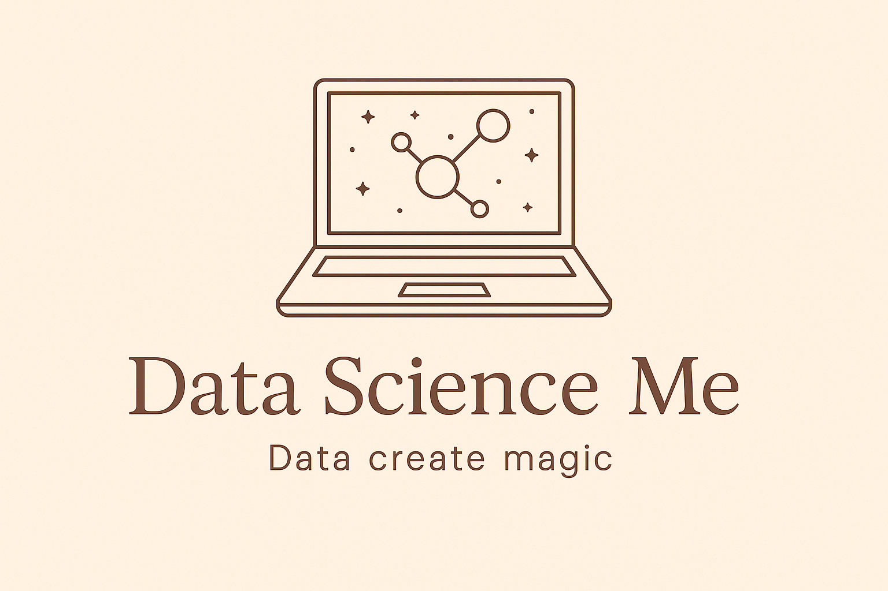
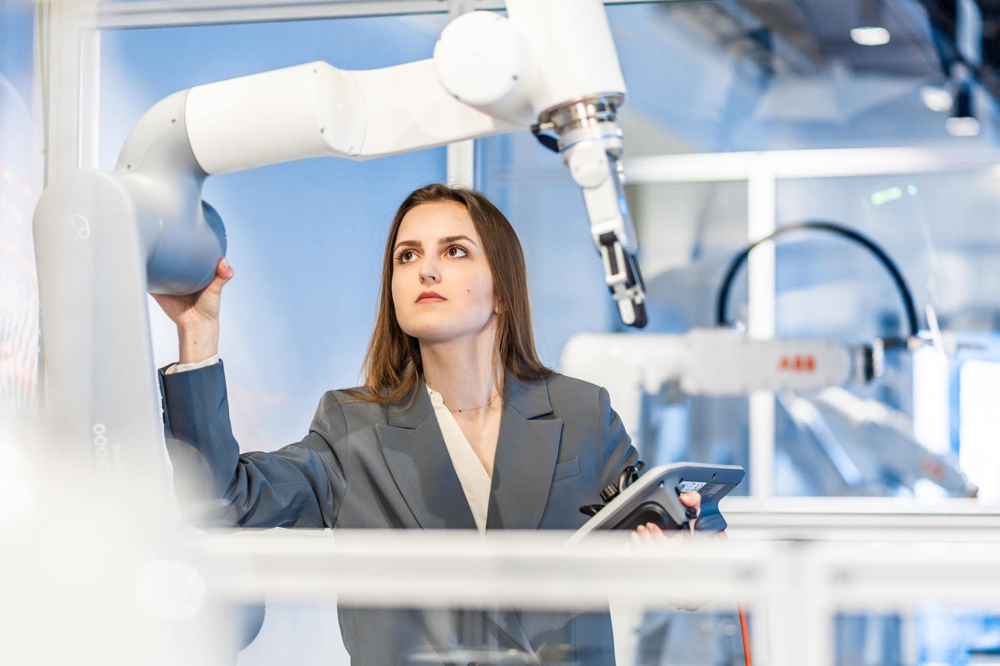

# Hi all! 🧚

  

I am thrilled with things we can do with data and how it can influence our life! ✨

- 🔭 I’m currently working on different apps to boost my data science knowledge and skills, eg.:
  - **Preorder Me: order helper for procurement specialists** (https://github.com/abinkiewicz/preorder_me),
  - Mate Me: clustering people's data from the course to find my matching friend (https://github.com/abinkiewicz/mate_me),
  - Transcript Me: app for transcripting my thoughts recorded in .mp3 (https://github.com/abinkiewicz/transcript_me),
  - Equestrian Me: my personal horse trainer (https://github.com/abinkiewicz/equestrian_me).
- 🌱 I’m currently learning how to use different machine learning models to make magic with data.
- 👯 I’m looking to collaborate on projects connected with data analysis, transformation and overall usage.
  
- 💬 Ask me about anything connected with my work.
- ⚡ Some facts about me:
  - 🤖 Despite the fact that I am a mechatronics engineer,
  - 🏞️ my natural habitat is nature.
  - 🐴 I adore horses, especially their emotional side - my stallion's name is Zordon,
  - 🐶 I am in love with my bossy mini dachshund named Chilli.
- 📫 You can find me on my LinkedIn: https://www.linkedin.com/in/aleksandra-binkiewicz/ or reach my e-mail: binkiewicz.ale@gmail.com

  

