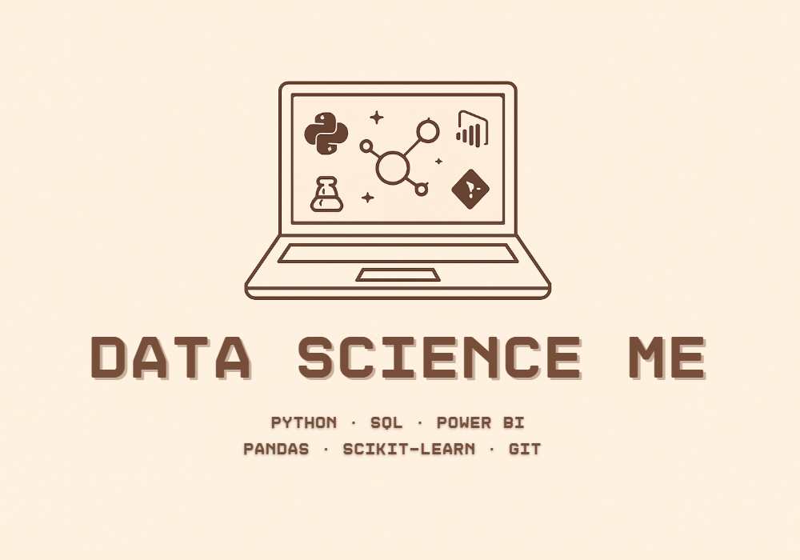

# Hi all! 🧚

My 🔧 tech stack: Python | Power BI | Excel | SQL | pandas | scikit-learn | Git | Streamlit | matplotlib | seaborn

  

I am thrilled with things we can do with data and how it can influence our life! ✨

- 🔭 I’m currently working on different apps to boost my data science knowledge and skills, eg.:
  - **Preorder Me: order helper for procurement specialists** (https://github.com/abinkiewicz/preorder_me),
  - **Business Me: KPIs calculator for financial data analysis and Power BI dashboards** (https://github.com/abinkiewicz/business_me),
  - Mate Me: clustering people's data from the course to find my matching friend (https://github.com/abinkiewicz/mate_me),
  - Transcript Me: app for transcripting my thoughts recorded in .mp3 (https://github.com/abinkiewicz/transcript_me),
  - Equestrian Me: my personal horse trainer (https://github.com/abinkiewicz/equestrian_me).

    In portfolio also: projects with **EDA**, **data preprocessing**, **multi-source integration**, all of them **Python**.
- 🌱 I’m learning how to use different **machine learning models** to make magic with data, while rediscovering the **power of Excel** and developing my **Power BI skills** — especially in the context of **clear, insightful dashboards and data visualizations**.
- 👯 I’m looking to collaborate on projects connected with data analysis, transformation and overall usage.
  
- 💬 Ask me about anything connected with my work.
- ⚡ Some facts about me:
  - Despite the fact that I am a mechatronics engineer,
  - my natural habitat is nature.
  - I adore horses, especially their emotional side - my stallion's name is Zordon,
  - I am in love with my bossy mini dachshund named Chilli.
- 📫 You can find me on my LinkedIn: https://www.linkedin.com/in/aleksandra-binkiewicz/ or reach my e-mail: binkiewicz.aleksandra@gmail.com

  

